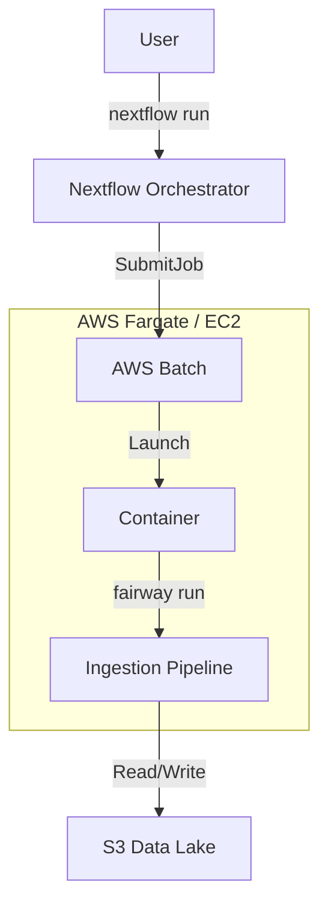

# Architecture

Fairway is designed to be **infrastructure-agnostic**. It uses a **Decoupled Worker** pattern throughout.

## Deployment Models

### 1. HPC (Slurm)
In a traditional HPC environment, Fairway runs as a "Nested" workload.

```mermaid
graph TD
    User[User] -->|nextflow run| NF[Nextflow Orchestrator]
    NF -->|sbatch| Driver[Driver Job (Compute Node)]
    
    subgraph "Slurm Job (Driver)"
        Driver -->|fairway run| FCLI[Fairway CLI]
        FCLI -->|sbatch| Workers[Spark Workers]
        FCLI -->|Run Pipeline| Ingestion[Ingestion Pipeline]
    end
    
    Workers -.- Ingestion
```

- **Orchestrator**: Nextflow (submits the main job).
- **Worker**: `fairway run` (provisions Spark cluster inside the allocation).
- **Resource**: Fixed Slurm allocation.

### 2. AWS (Serverless / Batch)
In a modern cloud environment, Fairway runs as a standard containerized task.



- **Orchestrator**: Nextflow (submits to AWS Batch).
- **Worker**: `fairway run` (runs the logic).
- **Resource**: Elastic (Fargate/EC2), scales to zero.
- **Spark**: Handled via EMR or Spark-on-K8s if needed, though often standalone DuckDB is sufficient for file-based ingestion.
