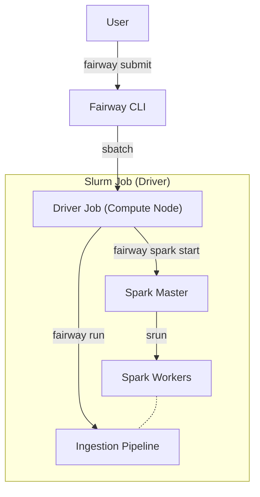

# Architecture

Fairway is designed to be **infrastructure-agnostic**. It uses a **Decoupled Worker** pattern throughout.

## Deployment Models

### 1. HPC (Slurm)
In a traditional HPC environment, Fairway runs as a Slurm job with optional Spark cluster provisioning.

```mermaid
graph TD
    User["User"] -->|fairway submit| CLI["Fairway CLI"]
    CLI -->|sbatch| Driver["Driver Job (Compute Node)"]

    subgraph "Slurm Job (Driver)"
        Driver -->|fairway spark start| SparkMaster["Spark Master"]
        SparkMaster -->|srun| Workers["Spark Workers"]
        Driver -->|fairway run| Pipeline["Ingestion Pipeline"]
    end

    Workers -.- Pipeline
```

- **Orchestrator**: `fairway submit` (generates and submits Slurm job script).
- **Worker**: `fairway run` (provisions Spark cluster inside the allocation).
- **Resource**: Configurable Slurm allocation (time, memory, CPUs).

