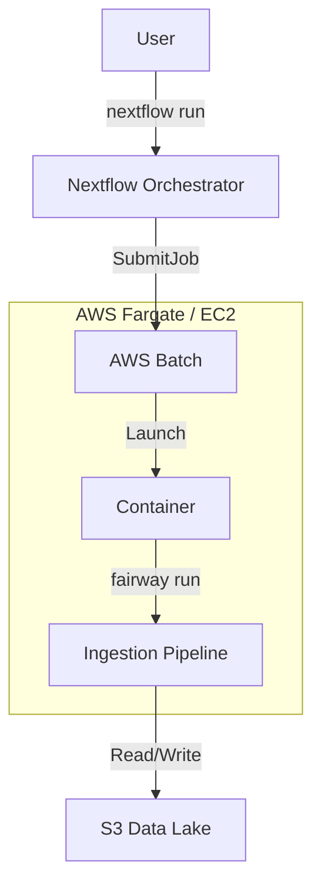

# make sure logs go to an organized place
right now slurm logs, onextflow do not

# getting the container working 

# test at AWS 

# Run on L2 data 
≈
# Data Products Feature
We removed the data-products feature from the docs but potentially want to make a feature in the future. Need to explore what that looks like.

# AWS Architecture Support
We removed the AWS architecture documentation to focus on the current feature set. This section described the planned support for AWS Batch/Fargate.

### 2. AWS (Serverless / Batch)
In a modern cloud environment, Fairway runs as a standard containerized task.

- **Orchestrator**: Nextflow (submits to AWS Batch).
- **Worker**: `fairway run` (runs the logic).
- **Resource**: Elastic (Fargate/EC2), scales to zero.
- **Spark**: Handled via EMR or Spark-on-K8s if needed, though often standalone DuckDB is sufficient for file-based ingestion.
